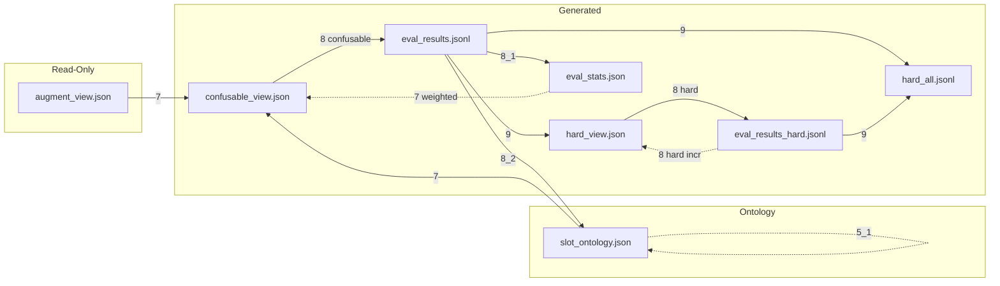
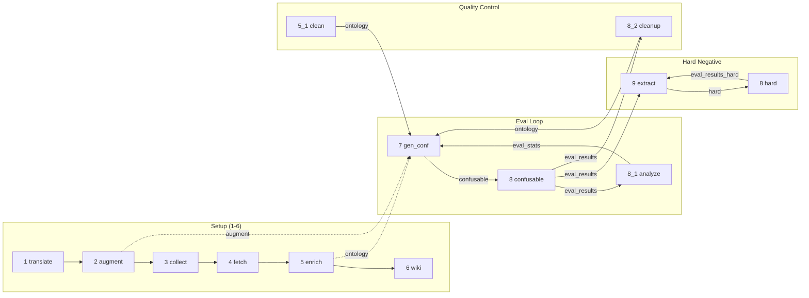

# Hard Negative Evaluation Pipeline

## 脚本职责

| 脚本 | 输入 | 输出 | 说明 |
|------|------|------|------|
| `1_translate_wiki` | raw metadata | 中文 wiki JSON | 一次性翻译 |
| `2_augment_wiki` | wiki JSON + video | `augment_{view}.json` | LLM 生成带槽位描述 |
| `3_collect_slots` | augment files | slot 清单 | 收集槽位词表 |
| `4_fetch_vocab_info` | slot 清单 | `slot_ontology.json` 初版 | 词义/关系抓取 |
| `5_enrich_with_llm` | slot_ontology.json | slot_ontology.json | LLM 丰富节点关系 |
| `5_1_clean_ontology` | slot_ontology.json | slot_ontology.json | LLM 删减 R1/R2/R3 违规关系 |
| `6_build_wiki` | slot_ontology.json | wiki/ | 构建可视化本体 |
| `7_gen_confusable` | augment + ontology + eval_stats | `confusable_{view}.json` | 加权生成混淆负样本 |
| `8_eval_confusable` | `{pattern}_{view}.json` + video | `eval_results{_pattern}.jsonl` | VLM 二选一评测 |
| `8_1_analyze` | eval_results*.jsonl | `eval_stats.json` + PNG | 统计分析 + Cohen's Kappa |
| `8_2_cleanup_pairs` | eval_results + ontology | 原地修改两者 | 剔除 R1/R3 违规对 |
| `9_extract_errors` | eval_results*.jsonl（可多个）| `hard_{view}.json` + `hard_all.jsonl` | 提取答错对；hard 固定 count=1，hard_all 跨轮累计 |

---

## 数据流图

以**数据文件**为节点，脚本编号标注在边上。



---

## 脚本调用图

以**带编号脚本**为节点，数据文件标注在边上。



---

## 迭代策略

```
第 0 轮（初始化，一次性）
  1 → 2 → 3 → 4 → 5 → 6

第 1 轮（建立基线）
  7(uniform) → 8 confusable → 8_1 → 8_2 → 5_1

第 N 轮（加权迭代）
  7(weighted) & 9         ← 可并行
  → 8（全跑，先 confusable 后 hard，hard 答错自动 +count）
  → 9(--input both)       ← 更新 hard_all.jsonl
  → 8_1                   ← 刷新 eval_stats
```

---

## 命令参考

```bash
cd tools/

# ── 第 N 轮 ───────────────────────────────────────────────────────────────────
python3 7_gen_confusable.py                    # 重建 confusable（加权）
python3 9_extract_errors.py                    # 提取 hard（可与上行并行）

python3 8_eval_confusable.py                   # 默认全跑：confusable → hard

python3 9_extract_errors.py \
    --input eval_results.jsonl eval_results_hard.jsonl   # 跨轮更新 hard_all

python3 8_1_analyze.py                         # 刷新 eval_stats.json

# ── 质量控制（按需）──────────────────────────────────────────────────────────
python3 8_2_cleanup_pairs.py
python3 5_1_clean_ontology.py --poe
```
