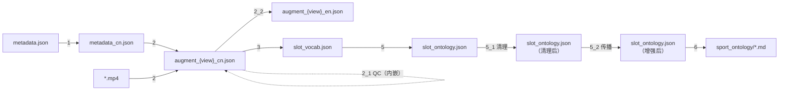
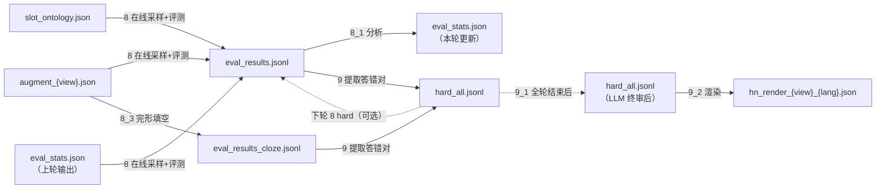
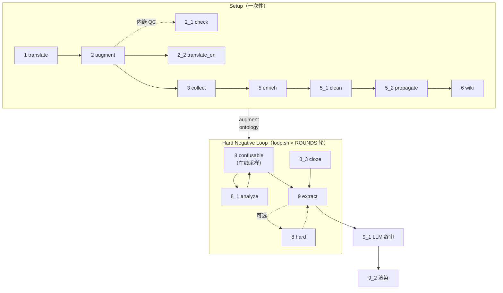

# Hard Negative Pipeline — 数据流与管线文档

---

## 脚本职责一览

| 脚本 | 输入 | 输出 | 说明 |
|------|------|------|------|
| `1_translate_wiki` | `metadata.json` | `metadata_cn.json` | 一次性翻译，积累字典缓存 |
| `2_augment_wiki` | `metadata_cn.json` + 视频 | `augment_{view}_cn.json` | VLM 生成槽位描述，内嵌 QC 循环 |
| `2_1_check_augment` | `augment_{view}.json` | `augment_{view}.json`（原地） | 两层槽位质检（独立批量或内嵌于 step 2） |
| `2_2_translate_augment` | `augment_{view}_cn.json` | `augment_{view}_en.json` | 将中文槽位描述翻译为英文，LLM 多轮自校正 |
| `3_collect_slots` | `augment_{view}.json` | `slot_vocab.json` + PNG | 槽位词频统计与可视化 |
| `5_enrich_with_llm` | `slot_vocab.json` | `slot_ontology.json` | LLM 构建本体（8 类关系属性） |
| `5_1_clean_ontology` | `slot_ontology.json` | `slot_ontology.json`（原地） | LLM 删减 R1/R2/R3/I1/I2 违规关系 |
| `5_2_infer_relations` | `slot_ontology.json` | `slot_ontology.json`（原地） | 纯集合运算的关系对称传播增强（无 LLM），迭代至收敛 |
| `6_build_wiki` | `slot_ontology.json` | `../sport_ontology/**/*.md` | 构建 Obsidian 可视化本体 |
| `8_eval_confusable` | `augment_{view}.json`（confusable 在线采样）/ `hard_{view}.json` + 视频 | `eval_results.jsonl` / `eval_results_hard.jsonl`（追加）+ `hard_all.jsonl`（`pred/error_count` 更新） | VLM 二选一评测；confusable 模式直接从 augment 在线采样，无需预生成文件 |
| `8_1_analyze` | `eval_results*.jsonl` | `eval_stats.json` + `eval_accuracy.png` | 统计准确率与 Cohen's Kappa，输出加权采样权重 |
| `8_3_cloze_eval` | `augment_{view}.json` + 视频 | `eval_results_cloze*.jsonl` | VLM 完形填空评测：所有槽位同时置空，自适应选项数 |
| `9_extract_errors` | `--from-eval eval_results*.jsonl` 或 `--merge hard_all*.jsonl` | `--out` 指定路径 | 两种互斥模式：提取答错对累入 hard_all（`--from-eval`），或合并多源 hard_all（`--merge`） |
| `9_1_clean_hard` | `hard_all.jsonl` + `augment_{view}.json` | `hard_all.jsonl`（原地） | LLM 句子级语境审核，删除上下文等价或视觉不可辨条目 |
| `9_2_render_hard` | `hard_all_{lang}.jsonl` + `augment_{view}_{lang}.json` | `{video}/hn_render_{view}_{lang}.json` | 将 hard_all 渲染为叶目录下的可视化文件，供人工标注 |

---

## 数据流图

### Setup 阶段（一次性）



### Hard Negative Loop（每轮迭代）



---

## 脚本调用图



---

## 迭代策略

```
第 0 步（Setup，一次性）
  1 → 2 (含 2.1 QC) → 2.2 (cn→en) → 3 → 5 → 5.1 → 5.2 → 6

第 1 轮（建立基线，loop.sh 第 1 次迭代）
  8 confusable（均匀采样，eval_stats.json 不存在） → 8.1 → 9

第 N 轮（加权迭代，loop.sh 第 N 次迭代）
  8 confusable（error_rate 加权在线采样）→ 8.1 → 9

全部轮次完成后
  9.1 LLM 句子级终审 → hard_all.jsonl（最终版）
  9.2 渲染 → hn_render_{view}_{lang}.json（人工标注用）

可选质量控制（手动按需执行）
  5.1 clean_ontology  — 重新清理本体关系
  5.2 infer_relations — 关系对称传播增强
  8 hard mode         — 对累计 hard 重新打分（需先 9 --reset-counts）
  8_3 cloze_eval      — 独立完形填空评测，结果可合入 9
```

---

## `hard_all.jsonl` 数据结构

`hard_all.jsonl` 是全局权威源，每行一条记录，key 为五元组字符串：

```
key = "{rel_path}|{view}|{slot}|{orig_value}|{replacement}"
```

每条记录包含：

| 字段 | 说明 |
|------|------|
| `video` | 视频相对路径（五元组第 1 位） |
| `view` | 视角（`front` / `side`，五元组第 2 位） |
| `replaced_slot` | 被替换的槽位名（五元组第 3 位） |
| `original_value` | 原始槽位值（五元组第 4 位） |
| `new_value` | 替换后的槽位值（五元组第 5 位） |
| `source` | 替换类型（`confusable_siblings` / `incompatibility` / `cloze`） |
| `error_count` | VLM 评测答错次数（仅 Step 8 更新） |
| `pred_count` | VLM 评测预测总次数 |
| `error_by_model` | 各模型的答错次数（dict） |
| `pred_by_model`  | 各模型的预测次数（dict） |
