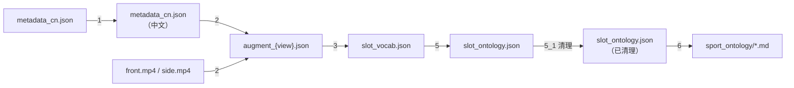
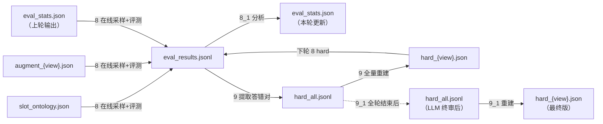
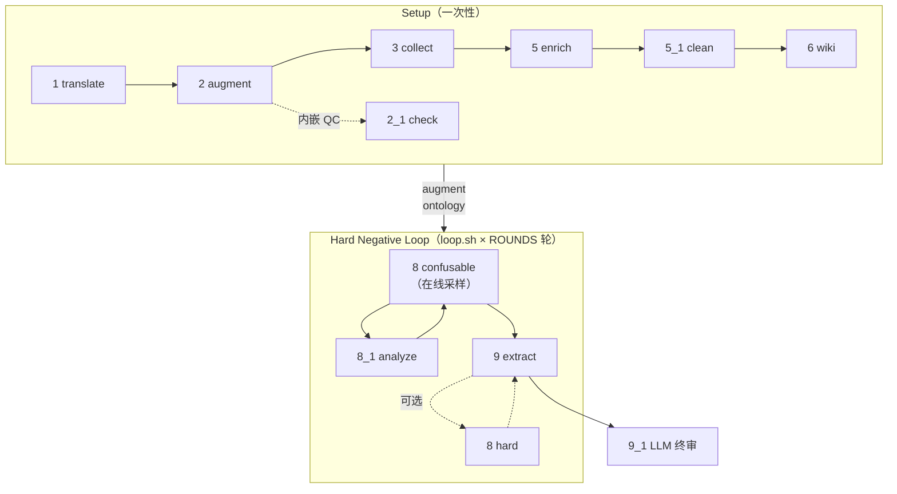

# Hard Negative Pipeline — 数据流与管线文档

---

## 脚本职责一览

| 脚本 | 输入 | 输出 | 说明 |
|------|------|------|------|
| `1_translate_wiki` | `metadata.json` | `metadata_cn.json` | 一次性翻译，积累字典缓存 |
| `2_augment_wiki` | `metadata_cn.json` + 视频 | `augment_{view}.json` | VLM 生成槽位描述，内嵌 QC 循环 |
| `2_1_check_augment` | `augment_{view}.json` | `augment_{view}.json`（原地） | 两层槽位质检（独立批量或内嵌于 step 2） |
| `3_collect_slots` | `augment_{view}.json` | `slot_vocab.json` + PNG | 槽位词频统计与可视化 |
| ~~`4_fetch_vocab_info`~~ | ~~—~~ | ~~—~~ | **已删除**（Wordnet 信息收集，用途有限） |
| `5_enrich_with_llm` | `slot_vocab.json` | `slot_ontology.json` | LLM 构建本体（8 类关系属性） |
| `5_1_clean_ontology` | `slot_ontology.json` | `slot_ontology.json`（原地） | LLM 删减 R1/R2/R3/I1/I2 违规关系 |
| `6_build_wiki` | `slot_ontology.json` | `../sport_ontology/**/*.md` | 构建 Obsidian 可视化本体 |
| `8_eval_confusable` | `augment_{view}.json`（confusable 在线采样）/ `hard_{view}.json` + 视频 | `eval_results.jsonl` / `eval_results_hard.jsonl`（追加）+ `hard_all.jsonl`（`pred/error_count` 更新） | VLM 二选一评测；confusable 模式直接从 augment 在线采样，无需预生成文件 |
| `8_1_analyze` | `eval_results*.jsonl` | `eval_stats.json` + `eval_accuracy.png` | 统计准确率与 Cohen's Kappa，输出加权采样权重 |
| `9_extract_errors` | `eval_results*.jsonl`（可多个） | `hard_all.jsonl`（累计）+ `hard_{view}.json`（重建） | 提取 VLM 答错对，跨轮幂等累计 |
| `9_1_clean_hard` | `hard_all.jsonl` + `augment_{view}.json` | `hard_all.jsonl`（原地）+ `hard_{view}.json`（重建） | LLM 句子级语境审核，删除上下文等价或视觉不可辨条目 |

---

## 数据流图

### Setup 阶段（一次性）



### Hard Negative Loop（每轮迭代）



---

## 脚本调用图



---

## 迭代策略

```
第 0 步（Setup，一次性）
  1 → 2 (含 2.1 QC) → 3 → 5 → 5.1 → 6

第 1 轮（建立基线，loop.sh 第 1 次迭代）
  8 confusable（均匀采样，eval_stats.json 不存在） → 8.1 → 9

第 N 轮（加权迭代，loop.sh 第 N 次迭代）
  8 confusable（error_rate 加权在线采样）→ 8.1 → 9

全部轮次完成后
  9.1 LLM 句子级终审 → hard_all.jsonl（最终版）

可选质量控制（手动按需执行）
  5.1 clean_ontology  — 重新清理本体关系
  8 hard mode         — 对累计 hard 重新打分（需先 9 --reset-counts）
```

---

## `hard_all.jsonl` 数据结构

`hard_all.jsonl` 是全局权威源，每行一条记录，key 为五元组字符串：

```
key = "{rel_path}|{view}|{slot}|{orig_value}|{replacement}"
```

每条记录包含：

| 字段 | 说明 |
|------|------|
| `key` | 五元组唯一标识 |
| `slot` | 被替换的槽位名 |
| `orig` | 原始槽位值 |
| `repl` | 替换后的槽位值 |
| `repl_type` | 替换类型（`confusable` / `incompatible`） |
| `error_count` | VLM 评测答错次数（仅 Step 8 更新） |
| `error_by_model` | 各模型的答错次数（dict） |

`hard_{view}.json` 每次由 `hard_all.jsonl` 全量派生重建，与当前 `augment` 版本解耦。

---

## 命令参考

```bash
cd tools/
HOST="127.0.0.1"
PORT="8001,8002,8003,8004,8005,8006,8007,8008"
WORKERS=8

# ── Setup（一次性）────────────────────────────────────────────────────────────
python3 1_translate_wiki.py  --host $HOST --port $PORT -w $WORKERS
python3 2_augment_wiki.py    --host $HOST --port $PORT --check -w $WORKERS
python3 3_collect_slots.py
python3 5_enrich_with_llm.py --host $HOST --port $PORT -w $WORKERS
python3 5_1_clean_ontology.py --poe
python3 6_build_wiki.py

# ── Hard Negative Loop（一键自动）────────────────────────────────────────────
bash loop.sh

# ── 手动单轮参考 ──────────────────────────────────────────────────────────────
python3 8_eval_confusable.py --host $HOST --port $PORT -w $WORKERS --mode confusable
python3 8_1_analyze.py
python3 9_extract_errors.py --input eval_results.jsonl --clean

# ── 质量控制（按需）──────────────────────────────────────────────────────────
python3 5_1_clean_ontology.py --poe
# 重新对累计 hard 打分（先清零计数）
python3 9_extract_errors.py --reset-counts
python3 8_eval_confusable.py --host $HOST --port $PORT -w $WORKERS --mode hard

# ── LLM 终审（loop.sh 已自动触发，也可手动运行）─────────────────────────────
python3 9_1_clean_hard.py --host $HOST --port $PORT -w $WORKERS --dry-run  # 试跑
python3 9_1_clean_hard.py --host $HOST --port $PORT -w $WORKERS

# ── 结果对比（双模型）────────────────────────────────────────────────────────
python3 8_1_analyze.py \
    --compare BAKUP/eval_results_vA.jsonl BAKUP/eval_results_vB.jsonl \
    --labels ModelA ModelB
```
