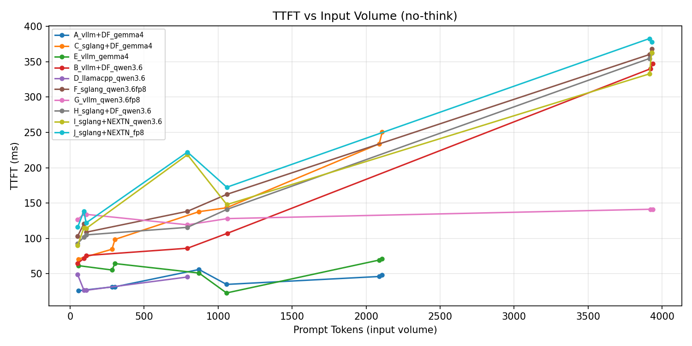
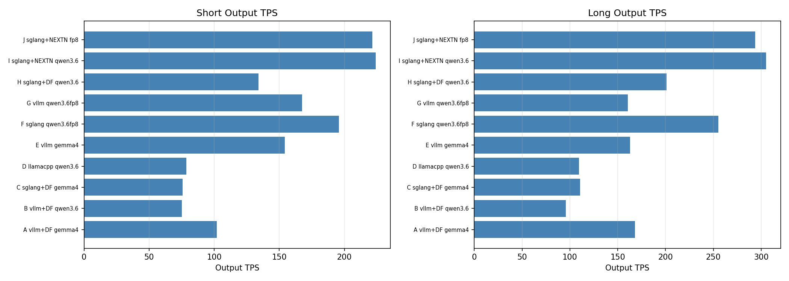
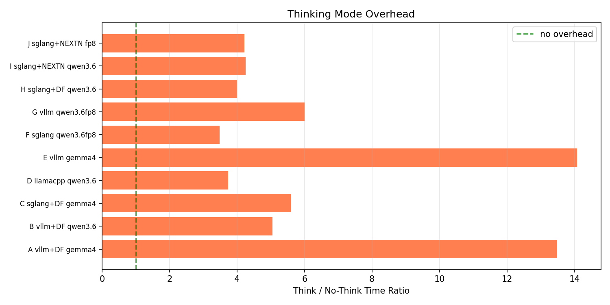
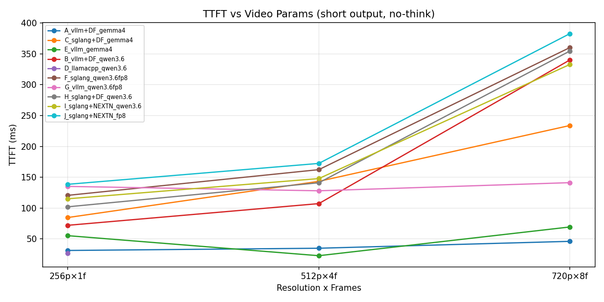

# LLM 推理效率基准测试报告

- 日期: 2026-05-19 20:32
- Warmup: 3, 测试轮数: 5 (IQR 去极端值)
- 测试视频: taiji.mp4 (1280×720, 17.2s)
- 并行测试: 各端点独立 GPU，互不干扰

## 端点配置

| ID | 框架 | 模型 | 加速方案 | 端口 | GPU卡号 | 卡数 |
|---|---|---|---|---|---|---|
| A | vllm | Gemma4-26B-A4B | DFLASH | 8001 | 4 | 1 |
| B | vllm | Qwen3.6-35B-A3B | DFLASH | 8000 | 0,1 | 2 |
| C | SGLang | Gemma4-26B-A4B | DFLASH | 30000 | 2,3 | 2 |
| D | llama.cpp | Qwen3.6-35B-A3B | Q4_K_XL+MTP | 8004 | 7 | 1 |
| E | vllm | Gemma4-26B-A4B | 无 | 8002 | 5 | 1 |
| F | SGLang | Qwen3.6-35B-A3B | FP8 | 8003 | 6 | 1 |
| G | vllm | Qwen3.6-35B-A3B | FP8 | 8003 | 6 | 1 |
| H | SGLang | Qwen3.6-35B-A3B | DFLASH | 30000 | 2,3 | 2 |
| I | SGLang | Qwen3.6-35B-A3B | NEXTN | 8003 | 6,7 | 2 |
| J | SGLang | Qwen3.6-35B-A3B-FP8 | FP8+NEXTN | 8003 | 6,7 | 2 |

## 维度一：输入量对 Prefill 速度的影响

对比不同输入规模下的 TTFT（首 token 延迟）和 Prefill TPS。

| 端点 | 用例 | Prompt Tokens | TTFT(ms) | Prefill TPS |
|---|---|---|---|---|
| A_vllm+DF_gemma4 | text_short_in_long_out | 55 | 26 | 2135 |
| A_vllm+DF_gemma4 | video_256p_1f_short_out | 283 | 31 | 9074 |
| A_vllm+DF_gemma4 | video_256p_1f_long_out | 303 | 31 | 9638 |
| A_vllm+DF_gemma4 | text_long_in_short_out | 871 | 56 | 15568 |
| A_vllm+DF_gemma4 | video_512p_4f_short_out | 1057 | 35 | 30339 |
| A_vllm+DF_gemma4 | video_720p_8f_short_out | 2089 | 46 | 45433 |
| A_vllm+DF_gemma4 | video_720p_8f_long_out | 2109 | 48 | 43895 |
| C_sglang+DF_gemma4 | text_short_in_long_out | 55 | 71 | 778 |
| C_sglang+DF_gemma4 | video_256p_1f_short_out | 283 | 85 | 3344 |
| C_sglang+DF_gemma4 | video_256p_1f_long_out | 303 | 98 | 3076 |
| C_sglang+DF_gemma4 | text_long_in_short_out | 871 | 138 | 6319 |
| C_sglang+DF_gemma4 | video_512p_4f_short_out | 1057 | 143 | 7376 |
| C_sglang+DF_gemma4 | video_720p_8f_short_out | 2089 | 234 | 8931 |
| C_sglang+DF_gemma4 | video_720p_8f_long_out | 2109 | 251 | 8416 |
| E_vllm_gemma4 | text_short_in_long_out | 55 | 61 | 895 |
| E_vllm_gemma4 | video_256p_1f_short_out | 283 | 55 | 5130 |
| E_vllm_gemma4 | video_256p_1f_long_out | 303 | 64 | 4715 |
| E_vllm_gemma4 | text_long_in_short_out | 871 | 51 | 17100 |
| E_vllm_gemma4 | video_512p_4f_short_out | 1057 | 23 | 46606 |
| E_vllm_gemma4 | video_720p_8f_short_out | 2089 | 69 | 30148 |
| E_vllm_gemma4 | video_720p_8f_long_out | 2109 | 71 | 29688 |
| B_vllm+DF_qwen3.6 | text_short_in_long_out | 51 | 64 | 792 |
| B_vllm+DF_qwen3.6 | video_256p_1f_short_out | 94 | 72 | 1305 |
| B_vllm+DF_qwen3.6 | video_256p_1f_long_out | 109 | 76 | 1441 |
| B_vllm+DF_qwen3.6 | text_long_in_short_out | 793 | 86 | 9223 |
| B_vllm+DF_qwen3.6 | video_512p_4f_short_out | 1063 | 107 | 9912 |
| B_vllm+DF_qwen3.6 | video_720p_8f_short_out | 3923 | 340 | 11531 |
| B_vllm+DF_qwen3.6 | video_720p_8f_long_out | 3938 | 347 | 11346 |
| D_llamacpp_qwen3.6 | text_short_in_long_out | 51 | 49 | 1047 |
| D_llamacpp_qwen3.6 | video_256p_1f_short_out | 93 | 27 | 3488 |
| D_llamacpp_qwen3.6 | video_256p_1f_long_out | 108 | 26 | 4077 |
| D_llamacpp_qwen3.6 | text_long_in_short_out | 793 | 45 | 17512 |
| F_sglang_qwen3.6fp8 | text_short_in_long_out | 51 | 103 | 494 |
| F_sglang_qwen3.6fp8 | video_256p_1f_short_out | 93 | 121 | 771 |
| F_sglang_qwen3.6fp8 | video_256p_1f_long_out | 108 | 109 | 994 |
| F_sglang_qwen3.6fp8 | text_long_in_short_out | 793 | 138 | 5733 |
| F_sglang_qwen3.6fp8 | video_512p_4f_short_out | 1059 | 162 | 6525 |
| F_sglang_qwen3.6fp8 | video_720p_8f_short_out | 3915 | 360 | 10867 |
| F_sglang_qwen3.6fp8 | video_720p_8f_long_out | 3930 | 368 | 10680 |
| G_vllm_qwen3.6fp8 | text_short_in_long_out | 51 | 126 | 403 |
| G_vllm_qwen3.6fp8 | video_256p_1f_short_out | 94 | 135 | 696 |
| G_vllm_qwen3.6fp8 | video_256p_1f_long_out | 109 | 134 | 814 |
| G_vllm_qwen3.6fp8 | text_long_in_short_out | 793 | 119 | 6650 |
| G_vllm_qwen3.6fp8 | video_512p_4f_short_out | 1063 | 128 | 8307 |
| G_vllm_qwen3.6fp8 | video_720p_8f_short_out | 3923 | 141 | 27774 |
| G_vllm_qwen3.6fp8 | video_720p_8f_long_out | 3938 | 141 | 27951 |
| H_sglang+DF_qwen3.6 | text_short_in_long_out | 51 | 93 | 550 |
| H_sglang+DF_qwen3.6 | video_256p_1f_short_out | 93 | 102 | 912 |
| H_sglang+DF_qwen3.6 | video_256p_1f_long_out | 108 | 105 | 1030 |
| H_sglang+DF_qwen3.6 | text_long_in_short_out | 793 | 116 | 6859 |
| H_sglang+DF_qwen3.6 | video_512p_4f_short_out | 1059 | 141 | 7511 |
| H_sglang+DF_qwen3.6 | video_720p_8f_short_out | 3915 | 355 | 11036 |
| H_sglang+DF_qwen3.6 | video_720p_8f_long_out | 3930 | 362 | 10849 |
| I_sglang+NEXTN_qwen3.6 | text_short_in_long_out | 51 | 90 | 567 |
| I_sglang+NEXTN_qwen3.6 | video_256p_1f_short_out | 93 | 115 | 809 |
| I_sglang+NEXTN_qwen3.6 | video_256p_1f_long_out | 108 | 114 | 948 |
| I_sglang+NEXTN_qwen3.6 | text_long_in_short_out | 793 | 218 | 3630 |
| I_sglang+NEXTN_qwen3.6 | video_512p_4f_short_out | 1059 | 148 | 7167 |
| I_sglang+NEXTN_qwen3.6 | video_720p_8f_short_out | 3915 | 333 | 11762 |
| I_sglang+NEXTN_qwen3.6 | video_720p_8f_long_out | 3930 | 363 | 10824 |
| J_sglang+NEXTN_fp8 | text_short_in_long_out | 51 | 116 | 441 |
| J_sglang+NEXTN_fp8 | video_256p_1f_short_out | 93 | 138 | 672 |
| J_sglang+NEXTN_fp8 | video_256p_1f_long_out | 108 | 122 | 886 |
| J_sglang+NEXTN_fp8 | text_long_in_short_out | 793 | 222 | 3569 |
| J_sglang+NEXTN_fp8 | video_512p_4f_short_out | 1059 | 172 | 6141 |
| J_sglang+NEXTN_fp8 | video_720p_8f_short_out | 3915 | 383 | 10226 |
| J_sglang+NEXTN_fp8 | video_720p_8f_long_out | 3930 | 378 | 10397 |

## 维度二：输出量对生成速度的影响

对比少量输出 vs 大量输出场景下的 Output TPS 和总耗时。

| 端点 | 用例 | Comp Tokens | Total(ms) | Output TPS |
|---|---|---|---|---|
| A_vllm+DF_gemma4 | video_256p_1f_short_out | 11 | 108 | 143.6 |
| A_vllm+DF_gemma4 | video_512p_4f_short_out | 11 | 113 | 141.5 |
| A_vllm+DF_gemma4 | text_long_in_short_out | 60 | 1150 | 54.8 |
| A_vllm+DF_gemma4 | video_720p_8f_short_out | 60 | 930 | 67.8 |
| A_vllm+DF_gemma4 | video_256p_1f_long_out | 1024 | 6054 | 170.0 |
| A_vllm+DF_gemma4 | video_720p_8f_long_out | 1024 | 7175 | 143.7 |
| A_vllm+DF_gemma4 | text_short_in_long_out | 1574 | 8319 | 189.8 |
| C_sglang+DF_gemma4 | video_256p_1f_short_out | 11 | 210 | 87.5 |
| C_sglang+DF_gemma4 | video_720p_8f_short_out | 11 | 383 | 73.7 |
| C_sglang+DF_gemma4 | video_512p_4f_short_out | 13 | 282 | 93.7 |
| C_sglang+DF_gemma4 | text_long_in_short_out | 60 | 1377 | 48.4 |
| C_sglang+DF_gemma4 | video_256p_1f_long_out | 1024 | 9154 | 113.1 |
| C_sglang+DF_gemma4 | video_720p_8f_long_out | 1024 | 10875 | 96.4 |
| C_sglang+DF_gemma4 | text_short_in_long_out | 1598 | 13110 | 122.5 |
| E_vllm_gemma4 | video_256p_1f_short_out | 7 | 92 | 191.8 |
| E_vllm_gemma4 | video_512p_4f_short_out | 13 | 96 | 176.3 |
| E_vllm_gemma4 | video_720p_8f_short_out | 13 | 142 | 179.2 |
| E_vllm_gemma4 | text_long_in_short_out | 60 | 913 | 69.6 |
| E_vllm_gemma4 | video_256p_1f_long_out | 997 | 6111 | 164.9 |
| E_vllm_gemma4 | video_720p_8f_long_out | 1008 | 6408 | 159.1 |
| E_vllm_gemma4 | text_short_in_long_out | 1676 | 10234 | 164.8 |
| B_vllm+DF_qwen3.6 | video_720p_8f_short_out | 8 | 437 | 82.6 |
| B_vllm+DF_qwen3.6 | video_512p_4f_short_out | 15 | 342 | 63.8 |
| B_vllm+DF_qwen3.6 | video_256p_1f_short_out | 32 | 557 | 66.0 |
| B_vllm+DF_qwen3.6 | text_long_in_short_out | 42 | 564 | 87.9 |
| B_vllm+DF_qwen3.6 | video_256p_1f_long_out | 1024 | 10623 | 97.1 |
| B_vllm+DF_qwen3.6 | video_720p_8f_long_out | 1024 | 10450 | 101.4 |
| B_vllm+DF_qwen3.6 | text_short_in_long_out | 1164 | 13202 | 88.6 |
| D_llamacpp_qwen3.6 | video_256p_1f_short_out | 22 | 253 | 107.5 |
| D_llamacpp_qwen3.6 | text_long_in_short_out | 42 | 928 | 49.5 |
| D_llamacpp_qwen3.6 | text_short_in_long_out | 943 | 9429 | 101.3 |
| D_llamacpp_qwen3.6 | video_256p_1f_long_out | 1024 | 8821 | 118.0 |
| F_sglang_qwen3.6fp8 | video_512p_4f_short_out | 9 | 200 | 238.2 |
| F_sglang_qwen3.6fp8 | video_720p_8f_short_out | 13 | 427 | 194.5 |
| F_sglang_qwen3.6fp8 | video_256p_1f_short_out | 21 | 224 | 202.8 |
| F_sglang_qwen3.6fp8 | text_long_in_short_out | 60 | 544 | 148.0 |
| F_sglang_qwen3.6fp8 | video_256p_1f_long_out | 1024 | 4096 | 256.8 |
| F_sglang_qwen3.6fp8 | video_720p_8f_long_out | 1024 | 4395 | 254.3 |
| F_sglang_qwen3.6fp8 | text_short_in_long_out | 1104 | 4440 | 254.6 |
| G_vllm_qwen3.6fp8 | video_256p_1f_short_out | 2 | 157 | 92.0 |
| G_vllm_qwen3.6fp8 | video_512p_4f_short_out | 14 | 211 | 169.4 |
| G_vllm_qwen3.6fp8 | video_720p_8f_short_out | 15 | 202 | 247.0 |
| G_vllm_qwen3.6fp8 | text_long_in_short_out | 46 | 404 | 161.6 |
| G_vllm_qwen3.6fp8 | video_256p_1f_long_out | 963 | 6164 | 159.7 |
| G_vllm_qwen3.6fp8 | video_720p_8f_long_out | 1024 | 6184 | 169.5 |
| G_vllm_qwen3.6fp8 | text_short_in_long_out | 1293 | 8630 | 152.1 |
| H_sglang+DF_qwen3.6 | video_256p_1f_short_out | 10 | 172 | 143.0 |
| H_sglang+DF_qwen3.6 | video_512p_4f_short_out | 10 | 227 | 116.2 |
| H_sglang+DF_qwen3.6 | video_720p_8f_short_out | 12 | 419 | 186.8 |
| H_sglang+DF_qwen3.6 | text_long_in_short_out | 43 | 595 | 89.8 |
| H_sglang+DF_qwen3.6 | text_short_in_long_out | 869 | 5212 | 169.8 |
| H_sglang+DF_qwen3.6 | video_256p_1f_long_out | 1024 | 4915 | 212.9 |
| H_sglang+DF_qwen3.6 | video_720p_8f_long_out | 1024 | 5013 | 220.2 |
| I_sglang+NEXTN_qwen3.6 | video_256p_1f_short_out | 10 | 160 | 224.5 |
| I_sglang+NEXTN_qwen3.6 | video_512p_4f_short_out | 10 | 177 | 343.2 |
| I_sglang+NEXTN_qwen3.6 | video_720p_8f_short_out | 13 | 393 | 216.2 |
| I_sglang+NEXTN_qwen3.6 | text_long_in_short_out | 43 | 602 | 112.2 |
| I_sglang+NEXTN_qwen3.6 | video_256p_1f_long_out | 1024 | 3437 | 308.1 |
| I_sglang+NEXTN_qwen3.6 | video_720p_8f_long_out | 1024 | 3696 | 307.2 |
| I_sglang+NEXTN_qwen3.6 | text_short_in_long_out | 1072 | 3667 | 299.7 |
| J_sglang+NEXTN_fp8 | video_512p_4f_short_out | 9 | 213 | 222.9 |
| J_sglang+NEXTN_fp8 | video_256p_1f_short_out | 10 | 178 | 254.3 |
| J_sglang+NEXTN_fp8 | video_720p_8f_short_out | 13 | 422 | 330.2 |
| J_sglang+NEXTN_fp8 | text_long_in_short_out | 43 | 768 | 78.8 |
| J_sglang+NEXTN_fp8 | video_256p_1f_long_out | 1024 | 3512 | 302.0 |
| J_sglang+NEXTN_fp8 | video_720p_8f_long_out | 1024 | 3792 | 300.0 |
| J_sglang+NEXTN_fp8 | text_short_in_long_out | 1121 | 4123 | 279.7 |

## 维度三：Think vs No-Think 模式对比

对比开启/关闭思考模式对耗时和输出量的影响。

| 端点 | 用例 | NoThink Total(ms) | Think Total(ms) | 开销比 | Think额外Tokens |
|---|---|---|---|---|---|
| A_vllm+DF_gemma4 | text_long_in_short_out | 1150 | 1819 | 1.58x | +452 |
| A_vllm+DF_gemma4 | text_short_in_long_out | 8319 | 26477 | 3.18x | +5030 |
| A_vllm+DF_gemma4 | video_256p_1f_long_out | 6054 | 11420 | 1.89x | +1126 |
| A_vllm+DF_gemma4 | video_256p_1f_short_out | 108 | 1831 | 16.99x | +501 |
| A_vllm+DF_gemma4 | video_512p_4f_short_out | 113 | 7480 | 66.43x | +501 |
| A_vllm+DF_gemma4 | video_720p_8f_long_out | 7175 | 13976 | 1.95x | +1298 |
| A_vllm+DF_gemma4 | video_720p_8f_short_out | 930 | 2172 | 2.33x | +427 |
| C_sglang+DF_gemma4 | text_long_in_short_out | 1377 | 2444 | 1.78x | +452 |
| C_sglang+DF_gemma4 | text_short_in_long_out | 13110 | 17247 | 1.32x | +6594 |
| C_sglang+DF_gemma4 | video_256p_1f_long_out | 9154 | 17842 | 1.95x | +1162 |
| C_sglang+DF_gemma4 | video_256p_1f_short_out | 210 | 2716 | 12.91x | +501 |
| C_sglang+DF_gemma4 | video_512p_4f_short_out | 282 | 2929 | 10.38x | +463 |
| C_sglang+DF_gemma4 | video_720p_8f_long_out | 10875 | 20226 | 1.86x | +1258 |
| C_sglang+DF_gemma4 | video_720p_8f_short_out | 383 | 3424 | 8.94x | +455 |
| E_vllm_gemma4 | text_long_in_short_out | 913 | 3174 | 3.48x | +452 |
| E_vllm_gemma4 | text_short_in_long_out | 10234 | 53030 | 5.18x | +6516 |
| E_vllm_gemma4 | video_256p_1f_long_out | 6111 | 13420 | 2.20x | +1179 |
| E_vllm_gemma4 | video_256p_1f_short_out | 92 | 2754 | 30.03x | +441 |
| E_vllm_gemma4 | video_512p_4f_short_out | 96 | 3132 | 32.49x | +489 |
| E_vllm_gemma4 | video_720p_8f_long_out | 6408 | 13911 | 2.17x | +1171 |
| E_vllm_gemma4 | video_720p_8f_short_out | 142 | 3262 | 23.00x | +499 |
| B_vllm+DF_qwen3.6 | text_long_in_short_out | 564 | 2400 | 4.26x | +470 |
| B_vllm+DF_qwen3.6 | text_short_in_long_out | 13202 | 26674 | 2.02x | +3177 |
| B_vllm+DF_qwen3.6 | video_256p_1f_long_out | 10623 | 23387 | 2.20x | +1497 |
| B_vllm+DF_qwen3.6 | video_256p_1f_short_out | 557 | 1985 | 3.56x | +153 |
| B_vllm+DF_qwen3.6 | video_512p_4f_short_out | 342 | 2769 | 8.09x | +278 |
| B_vllm+DF_qwen3.6 | video_720p_8f_long_out | 10450 | 27388 | 2.62x | +1938 |
| B_vllm+DF_qwen3.6 | video_720p_8f_short_out | 437 | 5512 | 12.61x | +504 |
| D_llamacpp_qwen3.6 | text_long_in_short_out | 928 | 2819 | 3.04x | +470 |
| D_llamacpp_qwen3.6 | text_short_in_long_out | 9429 | 31216 | 3.31x | +4006 |
| D_llamacpp_qwen3.6 | video_256p_1f_long_out | 8821 | 18649 | 2.11x | +1384 |
| D_llamacpp_qwen3.6 | video_256p_1f_short_out | 253 | 1643 | 6.50x | +194 |
| F_sglang_qwen3.6fp8 | text_long_in_short_out | 544 | 2025 | 3.72x | +452 |
| F_sglang_qwen3.6fp8 | text_short_in_long_out | 4440 | 12914 | 2.91x | +3541 |
| F_sglang_qwen3.6fp8 | video_256p_1f_long_out | 4096 | 8691 | 2.12x | +1455 |
| F_sglang_qwen3.6fp8 | video_256p_1f_short_out | 224 | 486 | 2.17x | +83 |
| F_sglang_qwen3.6fp8 | video_512p_4f_short_out | 200 | 1162 | 5.81x | +239 |
| F_sglang_qwen3.6fp8 | video_720p_8f_long_out | 4395 | 10410 | 2.37x | +1872 |
| F_sglang_qwen3.6fp8 | video_720p_8f_short_out | 427 | 2246 | 5.26x | +499 |
| G_vllm_qwen3.6fp8 | text_long_in_short_out | 404 | 2216 | 5.49x | +466 |
| G_vllm_qwen3.6fp8 | text_short_in_long_out | 8630 | 20245 | 2.35x | +2937 |
| G_vllm_qwen3.6fp8 | video_256p_1f_long_out | 6164 | 13025 | 2.11x | +1207 |
| G_vllm_qwen3.6fp8 | video_256p_1f_short_out | 157 | 1124 | 7.17x | +177 |
| G_vllm_qwen3.6fp8 | video_512p_4f_short_out | 211 | 1515 | 7.19x | +247 |
| G_vllm_qwen3.6fp8 | video_720p_8f_long_out | 6184 | 17703 | 2.86x | +2297 |
| G_vllm_qwen3.6fp8 | video_720p_8f_short_out | 202 | 2992 | 14.81x | +497 |
| H_sglang+DF_qwen3.6 | text_long_in_short_out | 595 | 1233 | 2.07x | +469 |
| H_sglang+DF_qwen3.6 | text_short_in_long_out | 5212 | 10118 | 1.94x | +3047 |
| H_sglang+DF_qwen3.6 | video_256p_1f_long_out | 4915 | 10097 | 2.05x | +1406 |
| H_sglang+DF_qwen3.6 | video_256p_1f_short_out | 172 | 637 | 3.71x | +94 |
| H_sglang+DF_qwen3.6 | video_512p_4f_short_out | 227 | 2335 | 10.29x | +502 |
| H_sglang+DF_qwen3.6 | video_720p_8f_long_out | 5013 | 11253 | 2.24x | +1783 |
| H_sglang+DF_qwen3.6 | video_720p_8f_short_out | 419 | 2406 | 5.74x | +500 |
| I_sglang+NEXTN_qwen3.6 | text_long_in_short_out | 602 | 3008 | 5.00x | +469 |
| I_sglang+NEXTN_qwen3.6 | text_short_in_long_out | 3667 | 10718 | 2.92x | +3759 |
| I_sglang+NEXTN_qwen3.6 | video_256p_1f_long_out | 3437 | 7146 | 2.08x | +1350 |
| I_sglang+NEXTN_qwen3.6 | video_256p_1f_short_out | 160 | 524 | 3.29x | +100 |
| I_sglang+NEXTN_qwen3.6 | video_512p_4f_short_out | 177 | 1644 | 9.29x | +502 |
| I_sglang+NEXTN_qwen3.6 | video_720p_8f_long_out | 3696 | 9241 | 2.50x | +2012 |
| I_sglang+NEXTN_qwen3.6 | video_720p_8f_short_out | 393 | 1855 | 4.72x | +499 |
| J_sglang+NEXTN_fp8 | text_long_in_short_out | 768 | 1407 | 1.83x | +469 |
| J_sglang+NEXTN_fp8 | text_short_in_long_out | 4123 | 11684 | 2.83x | +3502 |
| J_sglang+NEXTN_fp8 | video_256p_1f_long_out | 3512 | 7282 | 2.07x | +1279 |
| J_sglang+NEXTN_fp8 | video_256p_1f_short_out | 178 | 1407 | 7.91x | +395 |
| J_sglang+NEXTN_fp8 | video_512p_4f_short_out | 213 | 1626 | 7.64x | +463 |
| J_sglang+NEXTN_fp8 | video_720p_8f_long_out | 3792 | 10260 | 2.71x | +2277 |
| J_sglang+NEXTN_fp8 | video_720p_8f_short_out | 422 | 1916 | 4.54x | +499 |

## 维度四：视频分辨率与帧数的影响

对比不同分辨率和帧数组合对 TTFT 和总耗时的影响。

| 端点 | 分辨率 | 帧数 | 输出类型 | TTFT(ms) | Total(ms) | Output TPS |
|---|---|---|---|---|---|---|
| A_vllm+DF_gemma4 | 256p | 1f | 长 | 31 | 6054 | 170.0 |
| A_vllm+DF_gemma4 | 256p | 1f | 短 | 31 | 108 | 143.6 |
| A_vllm+DF_gemma4 | 512p | 4f | 短 | 35 | 113 | 141.5 |
| A_vllm+DF_gemma4 | 720p | 8f | 长 | 48 | 7175 | 143.7 |
| A_vllm+DF_gemma4 | 720p | 8f | 短 | 46 | 930 | 67.8 |
| C_sglang+DF_gemma4 | 256p | 1f | 长 | 98 | 9154 | 113.1 |
| C_sglang+DF_gemma4 | 256p | 1f | 短 | 85 | 210 | 87.5 |
| C_sglang+DF_gemma4 | 512p | 4f | 短 | 143 | 282 | 93.7 |
| C_sglang+DF_gemma4 | 720p | 8f | 长 | 251 | 10875 | 96.4 |
| C_sglang+DF_gemma4 | 720p | 8f | 短 | 234 | 383 | 73.7 |
| E_vllm_gemma4 | 256p | 1f | 长 | 64 | 6111 | 164.9 |
| E_vllm_gemma4 | 256p | 1f | 短 | 55 | 92 | 191.8 |
| E_vllm_gemma4 | 512p | 4f | 短 | 23 | 96 | 176.3 |
| E_vllm_gemma4 | 720p | 8f | 长 | 71 | 6408 | 159.1 |
| E_vllm_gemma4 | 720p | 8f | 短 | 69 | 142 | 179.2 |
| B_vllm+DF_qwen3.6 | 256p | 1f | 长 | 76 | 10623 | 97.1 |
| B_vllm+DF_qwen3.6 | 256p | 1f | 短 | 72 | 557 | 66.0 |
| B_vllm+DF_qwen3.6 | 512p | 4f | 短 | 107 | 342 | 63.8 |
| B_vllm+DF_qwen3.6 | 720p | 8f | 长 | 347 | 10450 | 101.4 |
| B_vllm+DF_qwen3.6 | 720p | 8f | 短 | 340 | 437 | 82.6 |
| D_llamacpp_qwen3.6 | 256p | 1f | 长 | 26 | 8821 | 118.0 |
| D_llamacpp_qwen3.6 | 256p | 1f | 短 | 27 | 253 | 107.5 |
| F_sglang_qwen3.6fp8 | 256p | 1f | 长 | 109 | 4096 | 256.8 |
| F_sglang_qwen3.6fp8 | 256p | 1f | 短 | 121 | 224 | 202.8 |
| F_sglang_qwen3.6fp8 | 512p | 4f | 短 | 162 | 200 | 238.2 |
| F_sglang_qwen3.6fp8 | 720p | 8f | 长 | 368 | 4395 | 254.3 |
| F_sglang_qwen3.6fp8 | 720p | 8f | 短 | 360 | 427 | 194.5 |
| G_vllm_qwen3.6fp8 | 256p | 1f | 长 | 134 | 6164 | 159.7 |
| G_vllm_qwen3.6fp8 | 256p | 1f | 短 | 135 | 157 | 92.0 |
| G_vllm_qwen3.6fp8 | 512p | 4f | 短 | 128 | 211 | 169.4 |
| G_vllm_qwen3.6fp8 | 720p | 8f | 长 | 141 | 6184 | 169.5 |
| G_vllm_qwen3.6fp8 | 720p | 8f | 短 | 141 | 202 | 247.0 |
| H_sglang+DF_qwen3.6 | 256p | 1f | 长 | 105 | 4915 | 212.9 |
| H_sglang+DF_qwen3.6 | 256p | 1f | 短 | 102 | 172 | 143.0 |
| H_sglang+DF_qwen3.6 | 512p | 4f | 短 | 141 | 227 | 116.2 |
| H_sglang+DF_qwen3.6 | 720p | 8f | 长 | 362 | 5013 | 220.2 |
| H_sglang+DF_qwen3.6 | 720p | 8f | 短 | 355 | 419 | 186.8 |
| I_sglang+NEXTN_qwen3.6 | 256p | 1f | 长 | 114 | 3437 | 308.1 |
| I_sglang+NEXTN_qwen3.6 | 256p | 1f | 短 | 115 | 160 | 224.5 |
| I_sglang+NEXTN_qwen3.6 | 512p | 4f | 短 | 148 | 177 | 343.2 |
| I_sglang+NEXTN_qwen3.6 | 720p | 8f | 长 | 363 | 3696 | 307.2 |
| I_sglang+NEXTN_qwen3.6 | 720p | 8f | 短 | 333 | 393 | 216.2 |
| J_sglang+NEXTN_fp8 | 256p | 1f | 长 | 122 | 3512 | 302.0 |
| J_sglang+NEXTN_fp8 | 256p | 1f | 短 | 138 | 178 | 254.3 |
| J_sglang+NEXTN_fp8 | 512p | 4f | 短 | 172 | 213 | 222.9 |
| J_sglang+NEXTN_fp8 | 720p | 8f | 长 | 378 | 3792 | 300.0 |
| J_sglang+NEXTN_fp8 | 720p | 8f | 短 | 383 | 422 | 330.2 |

## 关键结论

| 端点 | 平均TTFT(ms) | 平均Total(ms) | 平均Output TPS | 平均Comp Tokens |
|---|---|---|---|---|
| A_vllm+DF_gemma4 | 39 | 3407 | 130.2 | 538 |
| C_sglang+DF_gemma4 | 146 | 5056 | 90.8 | 534 |
| E_vllm_gemma4 | 56 | 3428 | 158.0 | 539 |
| B_vllm+DF_qwen3.6 | 156 | 5168 | 83.9 | 473 |
| D_llamacpp_qwen3.6 | 37 | 4858 | 94.1 | 508 |
| F_sglang_qwen3.6fp8 | 194 | 2047 | 221.3 | 465 |
| G_vllm_qwen3.6fp8 | 132 | 3136 | 164.5 | 480 |
| H_sglang+DF_qwen3.6 | 182 | 2365 | 162.7 | 427 |
| I_sglang+NEXTN_qwen3.6 | 197 | 1733 | 258.7 | 457 |
| J_sglang+NEXTN_fp8 | 219 | 1858 | 252.6 | 463 |

## 分析与建议

### Gemma4 方案对比（A/C/E）

| 配置 | TPS | TTFT | 卡数 |
|---|---|---|---|
| E vllm 原生 | 158 | 56ms | 1 |
| A vllm+DFLASH | 130 | 39ms | 1 |
| C SGLang+DFLASH | 91 | 146ms | 2 |

### Qwen3.6 方案对比（B/D/F/G/H/I/J）

| 配置 | TPS | TTFT | 卡数 | 精度 |
|---|---|---|---|---|
| **I SGLang+NEXTN** | **259** | 197ms | 2 | BF16 |
| **J SGLang+NEXTN+FP8** | **253** | 219ms | 2 | FP8 |
| F SGLang+NEXTN+FP8 | 221 | 194ms | 1 | FP8 |
| G vllm FP8 | 165 | 132ms | 1 | FP8 |
| H SGLang+DFLASH | 163 | 182ms | 2 | BF16 |
| D llama.cpp Q4+MTP | 94 | 37ms | 1 | Q4 |
| B vllm+DFLASH | 84 | 156ms | 2 | BF16 |

### 关键发现：多卡效率分析

| 对比 | 1卡 | 2卡 | 多卡效率 |
|---|---|---|---|
| SGLang NEXTN: F(1卡FP8) vs J(2卡FP8) | 221 TPS | 253 TPS | 57% |
| SGLang NEXTN: F(1卡FP8) vs I(2卡BF16) | 221 TPS | 259 TPS | 59% |
| vllm: G(1卡FP8) vs B(2卡DFLASH) | 165 TPS | 84 TPS | 25% |

**结论**：batch=1 下多卡效率均不理想。SGLang (~58%) 远优于 vllm (~25%)，但仍不如单卡线性扩展。FP8 2卡(J=253) 与 BF16 2卡(I=259) 几乎相同，说明 2卡场景下瓶颈在通信而非计算。

### 最终推荐

| 场景 | 推荐 | TPS | 卡数 |
|---|---|---|---|
| 单请求最高吞吐 | I (SGLang+NEXTN BF16, 2卡) | 259 | 2 |
| 单卡最优性价比 | F (SGLang+NEXTN FP8, 1卡) | 221 | 1 |
| Gemma4 最优 | E (vllm, 1卡) | 158 | 1 |
| 最低首token延迟 | D (llama.cpp Q4+MTP) | 94 | 1 |
| 高并发推荐 | I 或 J (2卡，batch>1时效率更高) | — | 2 |