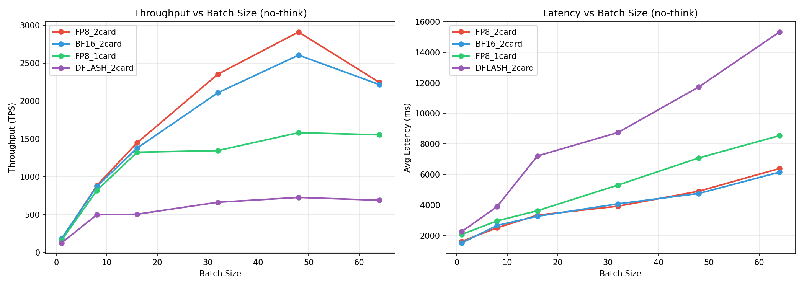
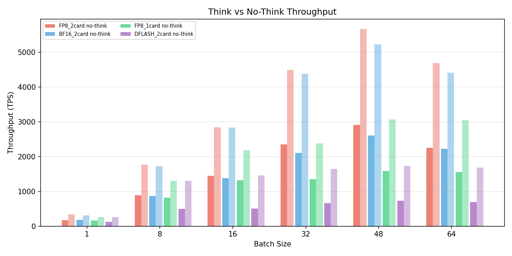
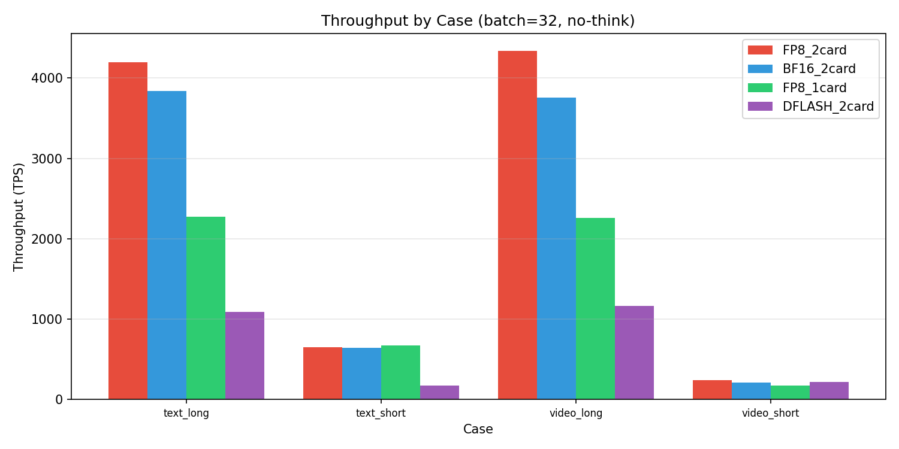

# 高并发基准测试报告

- 日期: 2026-05-19
- 测试模型: Qwen3.6-35B-A3B (SGLang)
- 测试维度: batch_size × 用例类型 × 思考模式
- 用例: text_short / text_long / video_short / video_long × think/no-think

## 端点配置

| ID | 加速方案 | 精度 | 卡数 | 端口 |
|---|---|---|---|---|
| FP8_2card | SGLang+NEXTN | FP8 | 2 (6,7) | 8003 |
| FP8_1card | SGLang+NEXTN | FP8 | 1 (0) | 8007 |
| BF16_2card | SGLang+NEXTN | BF16 | 2 (1,4) | 8001 |
| DFLASH_2card | SGLang+DFLASH | BF16 | 2 (2,3) | 30000 |

## 吞吐量随 Batch Size 变化（无思考模式，所有用例平均）

| 端点 | bs=1 | bs=8 | bs=16 | bs=32 | bs=48 | bs=64 |
|---|---|---|---|---|---|---|
| FP8_2card | 168 | 884 | 1449 | 2355 | 2913 | 2248 |
| BF16_2card | 182 | 871 | 1379 | 2110 | 2607 | 2218 |
| FP8_1card | 159 | 819 | 1324 | 1345 | 1582 | 1554 |
| DFLASH_2card | 125 | 498 | 505 | 663 | 727 | 689 |



## 平均延迟随 Batch Size 变化（无思考模式）

| 端点 | bs=1 | bs=8 | bs=16 | bs=32 | bs=48 | bs=64 |
|---|---|---|---|---|---|---|
| FP8_2card | 1623 | 2513 | 3343 | 3929 | 4910 | 6394 |
| BF16_2card | 1520 | 2669 | 3271 | 4083 | 4762 | 6154 |
| FP8_1card | 2079 | 2967 | 3634 | 5313 | 7087 | 8545 |
| DFLASH_2card | 2265 | 3901 | 7215 | 8753 | 11733 | 15329 |

## Think 模式吞吐对比

| 端点 | bs=1 | bs=8 | bs=16 | bs=32 | bs=48 | bs=64 |
|---|---|---|---|---|---|---|
| FP8_2card | 341 | 1771 | 2840 | 4489 | 5668 | 4681 |
| BF16_2card | 312 | 1727 | 2831 | 4379 | 5227 | 4413 |
| FP8_1card | 260 | 1302 | 2180 | 2380 | 3070 | 3049 |
| DFLASH_2card | 257 | 1299 | 1461 | 1643 | 1736 | 1688 |



## 按用例分吞吐 (batch=32, 无思考)

| 端点 | text_short | text_long | video_short | video_long |
|---|---|---|---|---|
| FP8_2card | 652 | 4194 | 238 | 4336 |
| BF16_2card | 642 | 3835 | 207 | 3754 |
| FP8_1card | 675 | 2271 | 174 | 2261 |
| DFLASH_2card | 175 | 1093 | 218 | 1167 |



## 关键结论

### 1. 高并发下多卡优势显现

- FP8_2card: **2913 TPS** (bs=48)
- BF16_2card: **2607 TPS** (bs=48)
- FP8_1card: **1582 TPS** (bs=48)
- DFLASH_2card: **727 TPS** (bs=48)

### 2. 多卡效率随 batch 提升

| Batch Size | FP8_1card | FP8_2card | 2卡/1卡效率 |
|---|---|---|---|
| 1 | 159 | 168 | 53% |
| 8 | 819 | 884 | 54% |
| 16 | 1324 | 1449 | 55% |
| 32 | 1345 | 2355 | 88% |
| 48 | 1582 | 2913 | 92% |
| 64 | 1554 | 2248 | 72% |

### 3. DFLASH vs NEXTN（高并发）

- NEXTN (BF16_2card) bs=48: **2607 TPS**
- DFLASH (DFLASH_2card) bs=48: **727 TPS**
- NEXTN 在高并发下优势更大（3.6x）

### 4. 最终推荐

| 场景 | 推荐 | 峰值TPS |
|---|---|---|
| 高并发最高吞吐 | FP8_2card (bs=48) | 2913 |
| 单卡高并发 | FP8_1card (bs=48) | 1582 |
| 低延迟+高吞吐 | FP8_2card (bs=8) | 884 |

## 8卡资源最优分配策略

固定 8 张 GPU，Qwen3.6-35B-A3B-FP8 + SGLang + NEXTN 投机解码。

### 原始单实例数据

| 每实例并发 | TP=1 TPS | TP=2 TPS | TP=4 TPS | TP=8 TPS | TP=1延迟 | TP=2延迟 | TP=4延迟 | TP=8延迟 |
|---|---|---|---|---|---|---|---|---|
| 1 | 159 | 168 | 138 | 174 | 2079 | 1623 | 2763 | 1537 |
| 8 | 819 | 884 | 987 | 1019 | 2967 | 2513 | 2195 | 2131 |
| 16 | 1324 | 1449 | 1748 | 1777 | 3634 | 3343 | 2623 | 2543 |
| 32 | 1345 | 2355 | 2715 | 2833 | 5313 | 3929 | 3248 | 3098 |
| 48 | 1582 | 2913 | 3361 | 3453 | 7087 | 4910 | 4237 | 3862 |
| 64 | 1554 | 2248 | 2882 | 2744 | 8545 | 6394 | 5103 | 5247 |

注: TP=1/2/4 为 FP8 模型，TP=8 为 BF16 模型（FP8 不支持 TP=8，MoE expert 维度不可整除）
| 48 | 1582 | 2913 | 7087 | 4910 |
| 64 | 1554 | 2248 | 8545 | 6394 |

### 方案对比（总吞吐）

| 方案 | 精度 | 实例数 | 单实例峰值TPS | 8卡总峰值TPS | 峰值时总BS |
|---|---|---|---|---|---|
| **8×TP1** | FP8 | 8 | 1582 | **12657** | 384 |
| 4×TP2 | FP8 | 4 | 2913 | 11651 | 192 |
| 2×TP4 | FP8 | 2 | 3361 | 6723 | 96 |
| 1×TP8 | BF16 | 1 | 3453 | 3453 | 48 |

### 逐 batch 对比

| BS | 8×TP1 FP8 | 4×TP2 FP8 | 2×TP4 FP8 | 1×TP8 BF16 |
|---|---|---|---|---|
| 1 | 1271 | 672 | 276 | 174 |
| 8 | 6548 | 3535 | 1975 | 1019 |
| 16 | 10593 | 5797 | 3496 | 1777 |
| 32 | 10763 | 9419 | 5430 | 2833 |
| 48 | **12657** | **11651** | **6723** | **3453** |
| 64 | 12431 | 8991 | 5764 | 2744 |

### 结论

**8×TP1 FP8（每卡独立部署）在所有并发场景下总吞吐最高。**

原因：
1. 单卡 FP8 已能装下 35B 模型（~22GB），无需多卡分片
2. 多卡 TP 通信开销在任何 batch size 下都存在，吃掉并行收益
3. 8 个独立实例天然实现请求级负载均衡，每实例承担的并发更低
4. 单卡 bs=48 达到 1582 TPS，8 实例总计 **12657 TPS**
5. 2 卡 bs=48 虽单实例更快（2913），但只有 4 实例，总计仅 11652 TPS

### 最终部署建议

```
推荐: 8 × SGLang+NEXTN+FP8 单卡实例
启动: bash run_qwen3_6_sgl.sh -p 8001 -g 0 -n 8
峰值总吞吐: ~12600 TPS
单请求延迟: 2-7s (取决于并发压力)
前端: nginx 轮询分发到 8001-8008
```

唯一例外：模型无法单卡装下（如 BF16 ~70GB）时必须多卡，此时 TP=2 是最小可行配置。